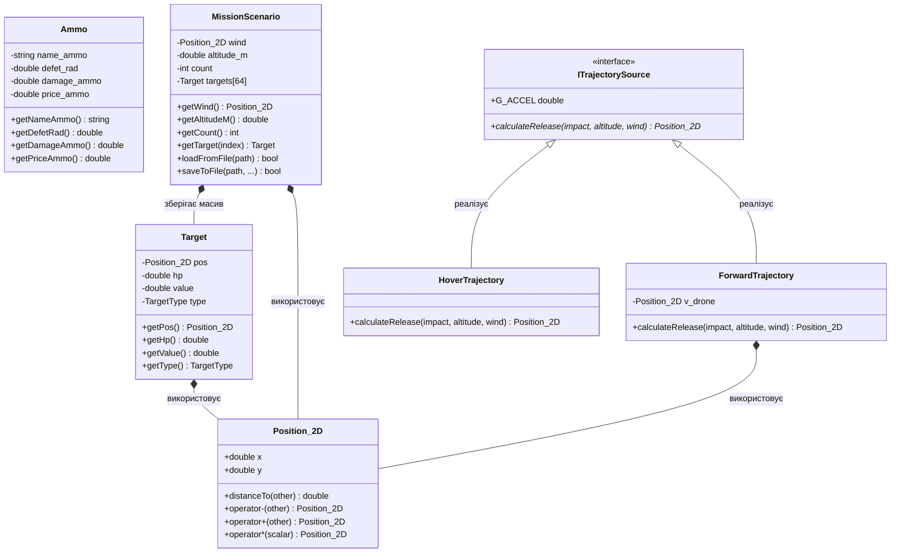

### Діаграма класів системи донаведення (ООП рефакторинг)

```mermaid
classDiagram
    class Position_2D {
        +double x
        +double y
        +distanceTo(other) double
        +operator-(other) Position_2D
        +operator+(other) Position_2D
        +operator*(scalar) Position_2D
    }

    class Target {
        -Position_2D pos
        -double hp
        -double value
        -TargetType type
        +getPos() Position_2D
        +getHp() double
        +getValue() double
        +getType() TargetType
    }

    class Ammo {
        -string name_ammo
        -double defet_rad
        -double damage_ammo
        -double price_ammo
        +getNameAmmo() string
        +getDefetRad() double
        +getDamageAmmo() double
        +getPriceAmmo() double
    }

    class MissionScenario {
        -Position_2D wind
        -double altitude_m
        -int count
        -Target targets[64]
        +getWind() Position_2D
        +getAltitudeM() double
        +getCount() int
        +getTarget(index) Target
        +loadFromFile(path) bool
        +saveToFile(path, ...) bool
    }

    class ITrajectorySource {
        <<interface>>
        +G_ACCEL double
        +calculateRelease(impact, altitude, wind)* Position_2D
    }

    class HoverTrajectory {
        +calculateRelease(impact, altitude, wind) Position_2D
    }

    class ForwardTrajectory {
        -Position_2D v_drone
        +calculateRelease(impact, altitude, wind) Position_2D
    }

    ITrajectorySource <|-- HoverTrajectory : реалізує
    ITrajectorySource <|-- ForwardTrajectory : реалізує
    MissionScenario *-- Target : зберігає масив
    Target *-- Position_2D : використовує
    MissionScenario *-- Position_2D : використовує
    ForwardTrajectory *-- Position_2D : використовує
```
